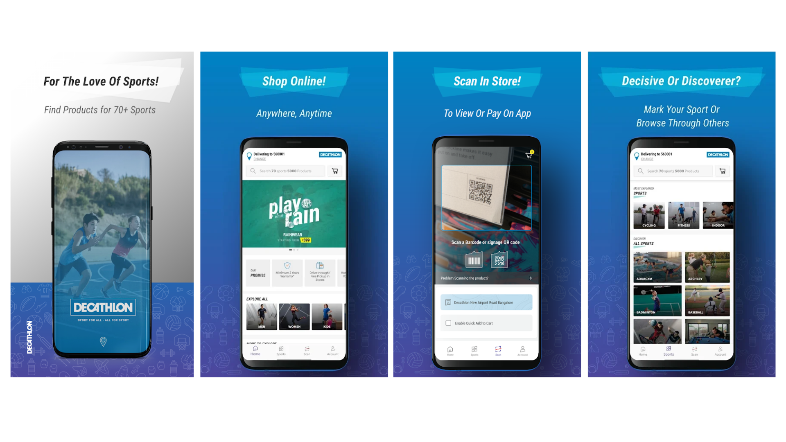

# Pankaj Kumar Jangid

### Hello, I am an android developer, i have 5+ years of experience , i always follow best practices for android application and I am always ready to learn new technologies, methods, and principle as per the project requirements.

&nbsp;&nbsp;&nbsp;&nbsp;&nbsp;&nbsp;&nbsp;&nbsp;&nbsp;

# Decathlon Online Shopping App
Now enjoy and experience the entire offering of Decathlon India’s 70+ sports and over 5,000 products by using the Decathlon mobile application!

#### Technolgies : Kotlin,Room,Dagger 2.0 ,RxJava / RxAndroid,RxRelay,Timber,Jetpack Libraries,Retrofit

## Thanks for stopping by!
  

   LICENCE
-----

 Copyright 2020 Pankaj Kumar Jangid

    Licensed under the Apache License, Version 2.0 (the "License");
    you may not use this file except in compliance with the License.
    You may obtain a copy of the License at

        http://www.apache.org/licenses/LICENSE-2.0

    Unless required by applicable law or agreed to in writing, software
    distributed under the License is distributed on an "AS IS" BASIS,
    WITHOUT WARRANTIES OR CONDITIONS OF ANY KIND, either express or implied.
    See the License for the specific language governing permissions and
    limitations under the License.
